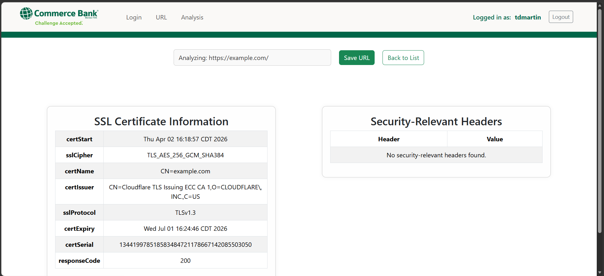
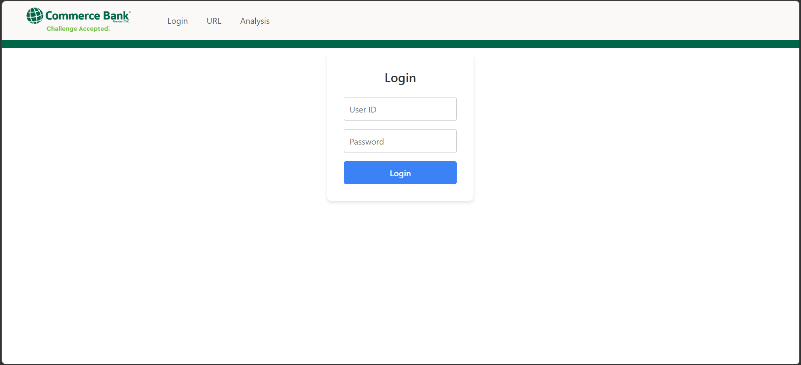
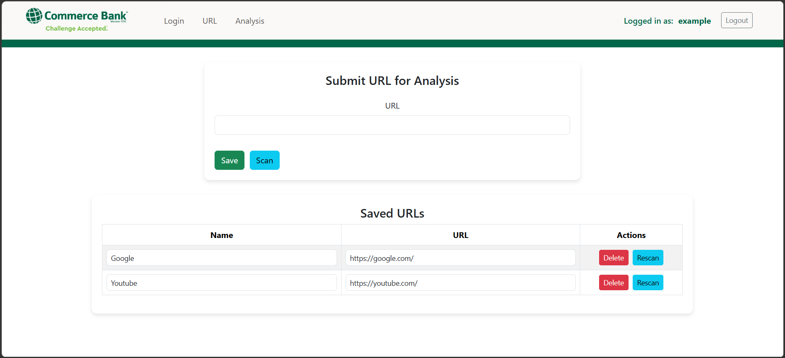

# Commerce Bank URL Analyzer

This project is Team Fantastic Four's Commerce Bank challenge application. It is a full-stack URL analyzer that lets a user log in, save URLs, edit or remove saved URLs, and scan URLs for basic HTTPS/security information.

The app has two parts:

- `BackEnd/demo`: Spring Boot API running on `http://localhost:8081`
- `FrontEnd/frontend/my-app`: React + Vite frontend running on `http://localhost:5173`

## Example Screenshots

### Analysis Results



### Login Screen



### URL List Screen



## What the App Does

The URL analyzer can:

- Accept a URL with or without `https://`
- Normalize and validate the URL before scanning
- Scan a URL without saving it
- Save URLs for the current user
- List saved URLs
- Edit saved URL names or values
- Delete saved URLs
- Rescan a saved URL
- Display HTTPS analysis details, including:
  - HTTP response code
  - SSL/TLS protocol
  - SSL cipher suite
  - Certificate subject/name
  - Certificate issuer
  - Certificate start and expiration dates
  - Certificate serial number
  - Common security response headers when present

## Prerequisites

Install these before running the project:

- Java JDK 17
- Node.js and npm
- IntelliJ IDEA, recommended for the backend
- Visual Studio Code or Visual Studio, recommended for the frontend

The backend Gradle build is configured for Java 17:

```gradle
languageVersion = JavaLanguageVersion.of(17)
```

JDK `17.0.12` works.

## Backend Setup

Open this folder in IntelliJ:

```text
BackEnd/demo
```

In IntelliJ, make sure the project and Gradle both use JDK 17:

1. Go to `File > Project Structure > Project`.
2. Set `SDK` to JDK 17.
3. Set `Language level` to 17.
4. Go to `File > Settings > Build, Execution, Deployment > Build Tools > Gradle`.
5. Set `Gradle JVM` to JDK 17.
6. Reload Gradle.

The backend uses an in-memory H2 database for local development:

```yaml
spring:
  datasource:
    url: jdbc:h2:mem:testdb
```

This means saved data resets when the backend stops.

## Run the Backend

From IntelliJ, run:

```text
Gradle > demo > Tasks > application > bootRun
```

Or run it from PowerShell:

```powershell
cd C:\Users\tdm01\OneDrive\Documents\GitHub\Commerce-Bank-Project_Fantastic-Four\BackEnd\demo
$env:JAVA_HOME='E:\Program Files\Java\jdk-17.0.12'
$env:Path="$env:JAVA_HOME\bin;$env:Path"
.\gradlew.bat bootRun
```

Leave the backend running while using the frontend.

## Verify the Backend

Open this in a browser:

```text
http://localhost:8081/hello
```

Expected response:

```text
Hello World
```

You can also test the analyzer API directly:

```text
http://localhost:8081/analyze?targetUrl=https%3A%2F%2Fexample.com
```

Expected response: JSON containing `ssl`, `headers`, and `url`.

## Frontend Setup

Open this folder in Visual Studio Code, Visual Studio, or a terminal:

```text
FrontEnd/frontend/my-app
```

Install dependencies if needed:

```powershell
npm.cmd install
```

Use `npm.cmd` on Windows PowerShell if plain `npm` is blocked by execution policy.

## Run the Frontend

Start the Vite dev server:

```powershell
cd C:\Users\tdm01\OneDrive\Documents\GitHub\Commerce-Bank-Project_Fantastic-Four\FrontEnd\frontend\my-app
npm.cmd run dev
```

Open the URL Vite prints. It is usually:

```text
http://localhost:5173
```

## Test the App Flow

Make sure the backend is running first.

1. Open `http://localhost:5173`.
2. Enter a username and password.
3. Log in.
4. You should be taken to the URL page.
5. Enter a URL such as:

```text
example.com
```

6. Click `Scan` to analyze it without saving.
7. Return to the URL page.
8. Enter a URL and click `Save URL`.
9. Confirm it appears in the saved URL list.
10. Try editing a saved URL or name.
11. Try `Rescan`.
12. Try deleting the saved URL.

## Useful Backend Endpoints

```text
GET    /hello
GET    /analyze?targetUrl={url}
GET    /analysis?urlId={id}
POST   /urls?userId={userId}
GET    /urls?userId={userId}
PUT    /urls/{urlId}
DELETE /urls/{urlId}
POST   /user
GET    /user?userId={userId}
```

## Build Commands

Backend:

```powershell
cd BackEnd\demo
.\gradlew.bat clean test
```

Frontend:

```powershell
cd FrontEnd\frontend\my-app
npm.cmd run build
```

## Troubleshooting

If the frontend cannot scan or save URLs, confirm the backend is running on:

```text
http://localhost:8081
```

If `npm` is blocked in PowerShell, use:

```powershell
npm.cmd run dev
```

If Gradle cannot find Java 17, confirm IntelliJ's `Gradle JVM` is set to JDK 17. If running from PowerShell, set `JAVA_HOME` before running Gradle:

```powershell
$env:JAVA_HOME='E:\Program Files\Java\jdk-17.0.12'
$env:Path="$env:JAVA_HOME\bin;$env:Path"
```

If the backend reports an H2 username/password error, confirm `BackEnd/demo/src/main/resources/application.yml` uses:

```yaml
url: jdbc:h2:mem:testdb
```

If port `8081` is already in use, stop the old backend run in IntelliJ before starting it again.
